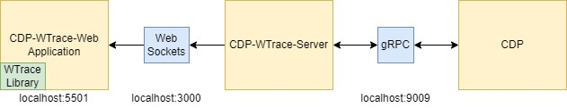

# WTrace-CDP

CDP-WTrace integration


## Overview



### Notes
- See [cdp-wtrace-web/src/types.ts](cdp-wtrace-web\src\types.ts) for the data formats between **CDP-WTrace-Web** and **CDP-WTrace-Server**.

## Setup

### 1) Setup WTrace library
Install the dependencies and build the project:
```sh
cd wtrace
npm install
npm run build
```

### 2) Setup CDP-WTrace Web Application
Install the dependencies:
```sh
cd cdp-wtrace-web
npm install
```

### 3) Setup CDP-WTrace Server
Install the dependencies:
```sh
cd cdp-wtrace-server
npm install
```

## How to run?

#### 1) Run CDP-WTrace Server
```sh
cd cdp-wtrace-server
npm run dev
```

#### 2) Run CDP-WTrace Web Application
```sh
cd cdp-wtrace-web
npm run dev
```
   
### Development
If an update is made to the wtrace library repository:

1) run ```npm run build``` at the wtrace library directory
